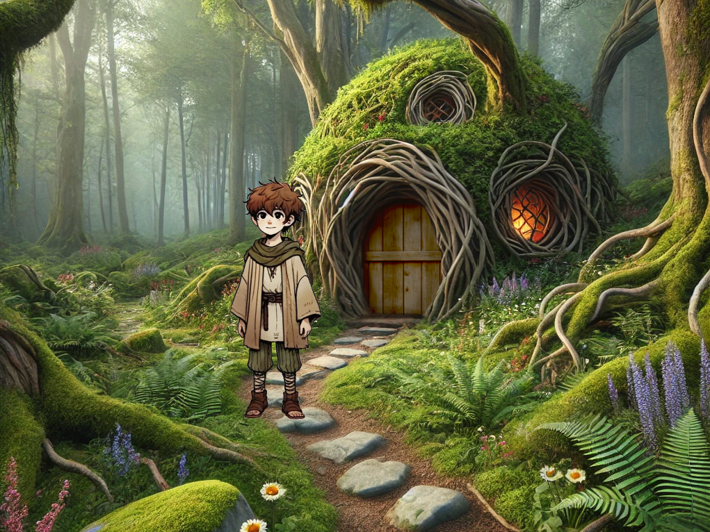

# Lyrus - Adventure Game Engine

Lyrus is a web-based adventure game engine built with Pixi.js and TypeScript.
It is being developed as part of a programming course project known as Coding Lab.



## Getting Started

### Prerequisites

- Node.js
- npm

### Installation

```bash
npm install
```

### Development

To start the development server:

```bash
npm run dev
```

### Build

To build the project for production:

```bash
npm run build
```

## Technologies Used

- [TypeScript](https://www.typescriptlang.org/) – Typed superset of JavaScript
- [Pixi.js](https://pixijs.com/) - 2D WebGL rendering engine
- [Vite](https://vitejs.dev/) - Frontend toolchain
- [RxJS](https://rxjs.dev/) - Reactive extensions for JavaScript
- [Ramda](https://ramdajs.com/) – Functional programming library
